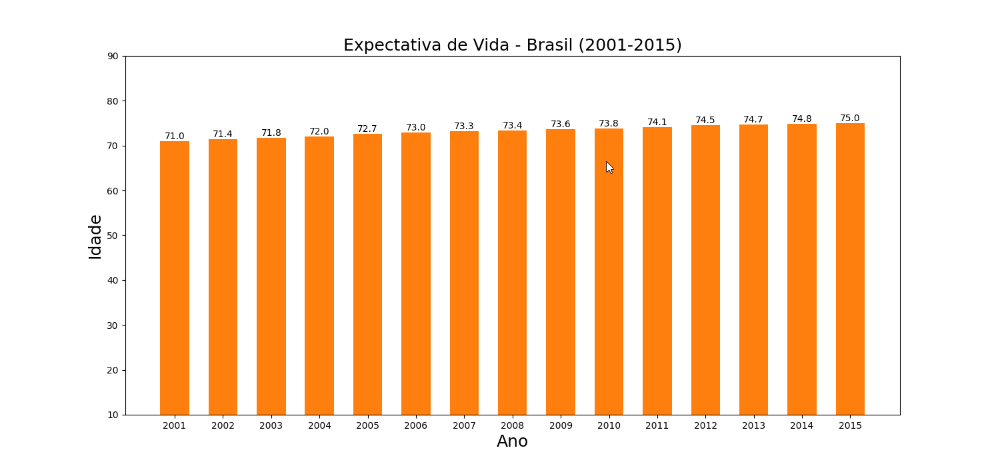
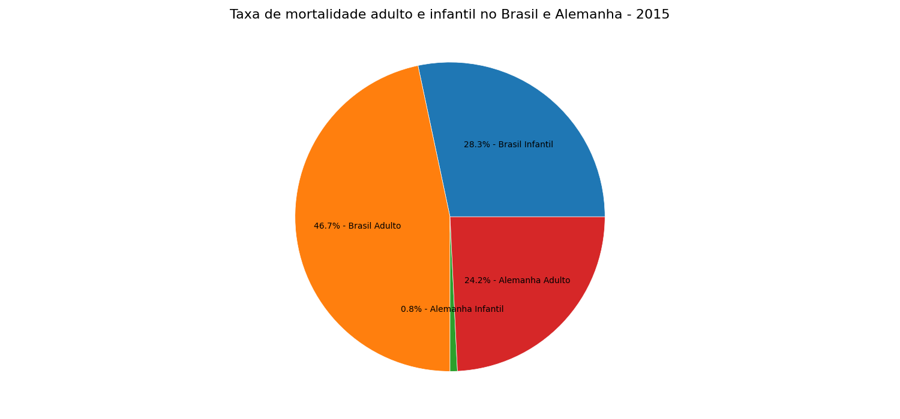
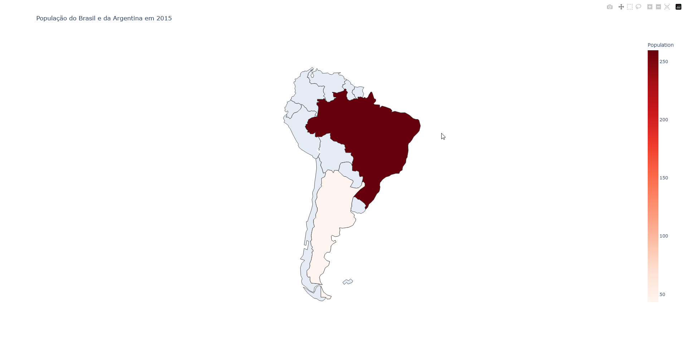

# Demographic data visualization

#### Description

This is a college project that creates a visualization for demographic data using the libraries matplotlib, plotly, and pandas, using a CSV that contains the dataset from: [Kaggle - Life Expectancy (WHO).](https://www.kaggle.com/datasets/kumarajarshi/life-expectancy-who/data "Kaggle - Life Expectancy (WHO).")

#### Requirements

 - `matplotlib` needs to installed externally using pip
 - `pandas` needs to intalled externally using pip
 - `plotly` needs to installed externally using pip
 - `python` I recommend python 3.12.2 for a better experience
  
#### Used Data

Using the dataset mentioned previously, I select specific data from the countries Brazil, Germany, and Argentina 

- `Bar chart` For the bar chart, I used the Life expectancy data from Brazil from 2001 to 2015. 
- `Pie chart` for this chart, I used the infants death and adult death from Brazil and Germany in 2015
- `Choropleth map` for this map, I used the population data from 2015 from Brazil and Argetina

### Bar Chart - Life Expectancy Brazil(2001 - 2015)

### Pie Chart - Infants death and Adult Death from Brazil and Germany in 2015

### Choropleth map - Population Brazil and Argentine in 2015
